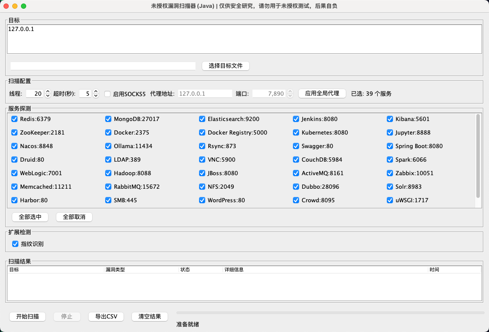

# Unauthorized Tools (Java GUI)

一个基于 Java Swing 的未授权访问探测工具，支持批量目标、并发扫描、SOCKS5 全局代理、CSV 导出。

## 功能

- 批量目标输入（文本框或文件导入）
- 39+ 常见未授权服务探测（Redis、MongoDB、Elasticsearch、Docker、Kubernetes、Spring Boot、Druid 等）
- 指纹识别（支持 HTTP/HTTPS、跟随重定向、按输入 URL 路径识别）
- SOCKS5 全局代理（对 HTTP/HTTPS 和 socket 探测生效）
- 扫描结果表格展示与 CSV 导出

## 界面展示



## 运行环境

- JDK 8 及以上（推荐 JDK 17/21）
- macOS / Linux / Windows

## 目录结构

```text
src/main/java/com/example/tool/
  MainApp.java
  MainWindow.java
  VulnerabilityScanner.java
  ServiceCheck.java
  TargetInfo.java
  CheckOutcome.java
  ScanRecord.java
```

## 构建与运行

### 方式一：Maven

```bash
mvn clean package
java -jar target/unauthorized-tools-1.0.0.jar
```

### 方式二：本地 javac + jar

```bash
mkdir -p target/classes
find src/main/java -name '*.java' -print0 | xargs -0 javac -encoding UTF-8 -d target/classes
jar --create --file target/unauthorized-tools-1.0.0.jar --main-class com.example.tool.MainApp -C target/classes .
java -jar target/unauthorized-tools-1.0.0.jar
```

## 使用说明

1. 输入目标（每行一个），支持：
   - `example.com`
   - `example.com:8080`
   - `http://example.com`
   - `https://example.com/path?a=1`
2. 选择探测项和线程数、超时时间。
3. 如需代理，勾选 `启用SOCKS5` 并应用代理设置。
4. 点击 `开始扫描`，扫描完成后可 `导出CSV`。

## 说明与限制

- 当前结果表默认展示命中项（状态为“漏洞”）。
- 大多数服务探测基于默认端口；若目标是非标准端口，请在目标中显式填写端口。
- HTTPS 已支持忽略证书校验（自签名/证书异常目标也可请求）。


## 合规声明

请仅在已授权的资产范围内使用本工具。使用者需自行承担法律与合规责任。
